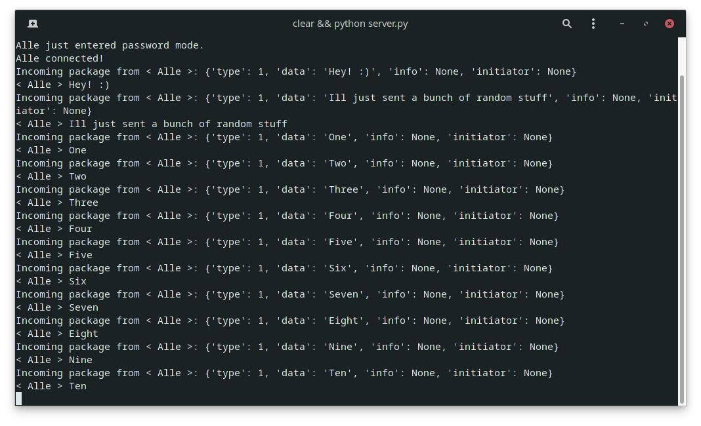
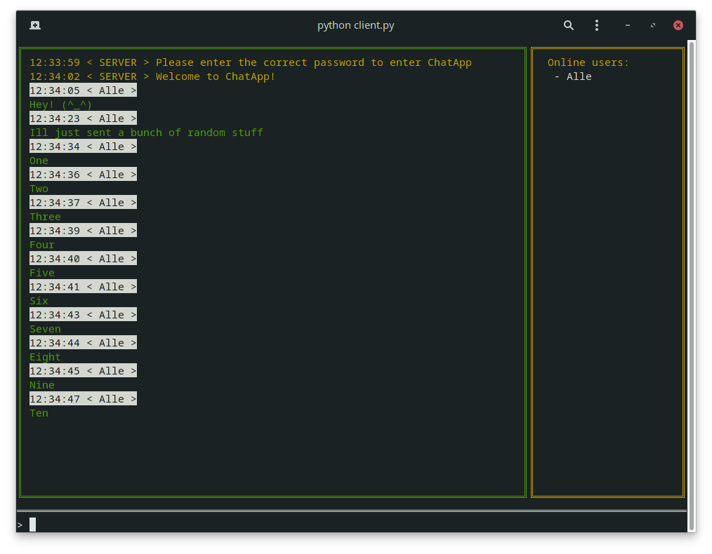

# ChatApp
A Terminal Chat Application that makes you 'shut up' heuheuheu :)

## Setup

To clone the repository:

    $ git clone https://github.com/alexemanuelol/ChatApp.git

Install the required packages:

    $ cd chatapp
    $ pip install -r requirements.txt
    $ pip install -r src/terminal-text-boxes/requirements.txt

## Example

The server application

The client application

You press `<ESC>` to exit the client application

## Documentation

### Package structure
Every package sent between clients and the server is structured like this:

    package = {
        "type"          : None,
        "data"          : None,
        "info"          : None,
        "initiator"     : None
    }

The different package types:

    types = {
        "command"       : 0,
        "message"       : 1,
        "notify"        : 2,
        "error"         : 3
    }

### Client Commands

Command prefix is set to: !

Commands:
- setNickname
- getUsers

Example:

    !setNickname Awesom-O
